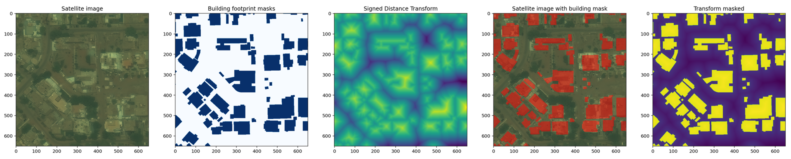
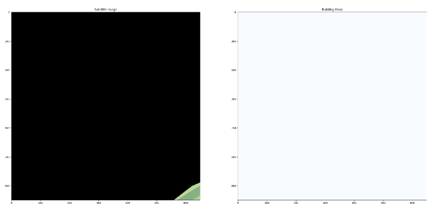
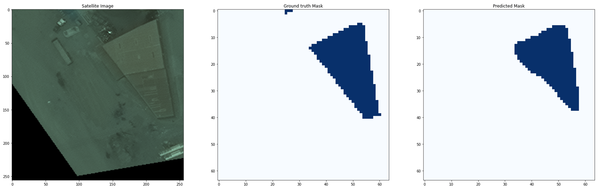
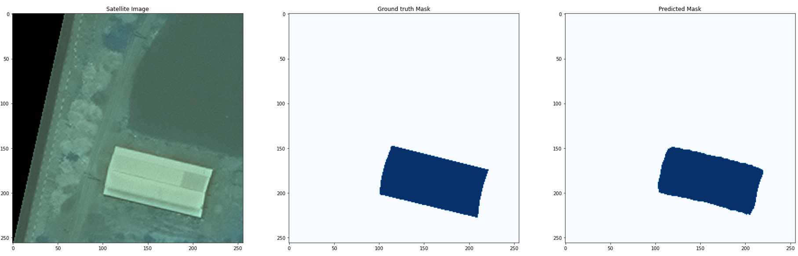
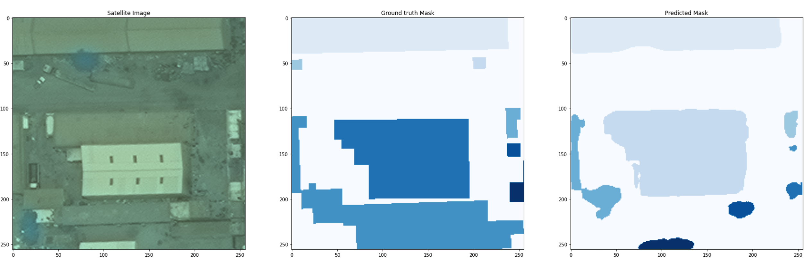
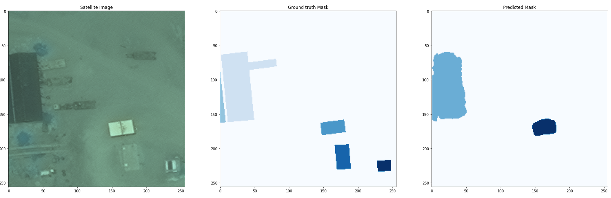

# Extracting-Building-Footprints-from-Satellite-imagery

# Getting data

In this work, I used Spacenet 2 : Khartoum dataset. Refer to [link](https://spacenet.ai/khartoum/) for detail. 

  <pre><code> aws s3 cp s3://spacenet-dataset/spacenet/SN2_buildings/tarballs/SN2_buildings_train_AOI_5_Khartoum.tar.gz . 
 aws s3 cp s3://spacenet-dataset/spacenet/SN2_buildings/tarballs/AOI_5_Khartoum_test_public.tar.gz . 
  </code></pre>

Utilizing datasets, need an access to AWS CLI. Authentification required further, and Refer to [aws cli](https://aws.amazon.com/cli/?nc1=h_ls) for details.

# Preparing data
Preprocessing satellite data is an essential in this work. Such processes include : 

- transforming GeoTiff data to 8-bit RGB image using part of solaris library
- creating ground-truth building mask using geojson vector data(coordinate correction needed)
- creating ground-truth signed-transformed data
- creating an adequate input data to a model

required methods are shown in utils folder. Some of them are provied from spacenet-utils in [link](https://github.com/avanetten/spacenet_buildings_exploration), but had to change to fit to the dataset(Khartoum dataset) and due to library dependency issues.

An example of transformed GeoTIFF, geojson data can be shown below

False datas are also included in the datasets such as below, so "sifting" such datas are also required. 

After sifting, only some of images remain out of 1012 images, there for apply 90, 180, 270, 360 degree rotation and create extra inputs

# metrics
- IoU(Intersection over Union) : use mean IOU for each case

- F1 Score : during test, form pixel-wise confusion matrix and get F1 score for model evaluation

# Results
**baseline** : f1-score converges to 0

**baseline+(best predicted)** : 

- mIOU : 0.792, F1-score : 0.0357
  
**U-net(best predicted)** : 

 

- mIOU : 0.906, F1-score : 0.3764

**Additional U-net predictions** : 

 

 

*buildings distinguished by different colors

# References
- spacenet-utilities : (https://github.com/avanetten/spacenet_buildings_exploration)
- U-Net: Convolutional Networks for Biomedical Image Segmentation : (https://arxiv.org/abs/1505.04597)
- http://vision.stanford.edu/teaching/cs231n/reports/2017/pdfs/550.pdf

# Others

 Possible additional works 
 - applying transformer based model such as DETR
    (https://arxiv.org/abs/2005.12872)
 - stacking OpenStreetMap data to given input, from OSM API
    (https://www.openstreetmap.org/)